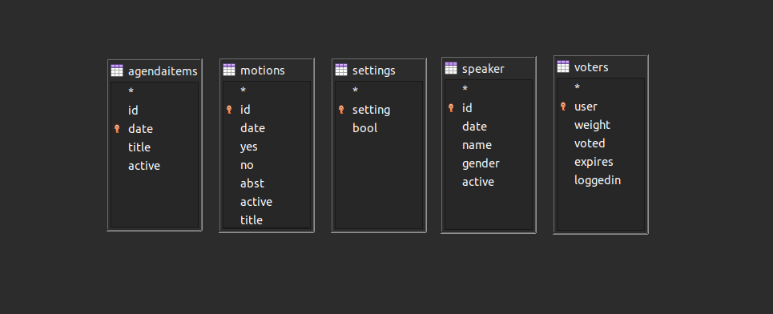
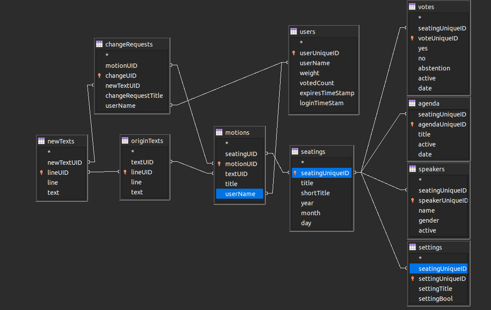

## Assembly Management Tool

Free and open source variant of an Assembly Voting and Agenda System.

---

## Deploy with docker-compose and traefik

---

## Development and Attribution

This is a [Next.js](https://nextjs.org/) project bootstrapped with [`create-next-app`](https://github.com/vercel/next.js/tree/canary/packages/create-next-app).

---
## Getting Started

First, run the development server:

```bash
npm run dev
# or
yarn dev
```

Open [http://localhost:3000](http://localhost:3000) with your browser to see the result.

---

## ToDo'S:

- Cleanup API Routes / Minimize API Routes
- Create Endpoints for Motions/Change Requests
- Create Frontend for Motions/Change Requests
- Update Database
- 

---

## API

The API is written with serverless-mysql for React.


### Current Endpoints

#### Agenda
- https://localhost:3000/agenda
- /agenda/add
- /agenda/clear
- /agenda/deactivatecurrent
- /agenda/remove
- /agenda/retrieve
- /agenda/retrievecurrent
- /agenda/setcurrent

#### Settings
- https://localhost:3000/settings
- /settings/quotation
- /settings/retrievequotation

#### Speakers
- https://localhost:3000/speakers
- /speakers/add
- /speakers/clear
- /speakers/remove
- /speakers/retrieve
- /speakers/setactive
- /speakers/setdeactive

#### Submit Vote
- https://localhost:3000/submitvote
- /submitvote/abst
- /submitvote/no
- /submitvote/yes

#### Voters
- https://localhost:3000/voters
- /voters/addvoter
- /voters/retrieve
- /voters/updatevoter

#### Voting
- https://localhost:3000/voting
- /voting/addanalogue
- /voting/clear
- /voting/retrieve
- /voting/retrievecurrent
- /voting/startvote
- /voting/stopvote

### Coming Endpoints in [February Update]

#### Motions
- https://localhost:3000/motions
- /motions/create
- /motions/edit
- /motions/retrieve
- /motions/acceptchange
- more

#### Change Requests
- https://localhost:3000/changerequest
- /changerequest/create
- /changerequest/edit
- /changerequest/retrieve
- more

---

## Current Database



---

## Coming Database [February Update]

